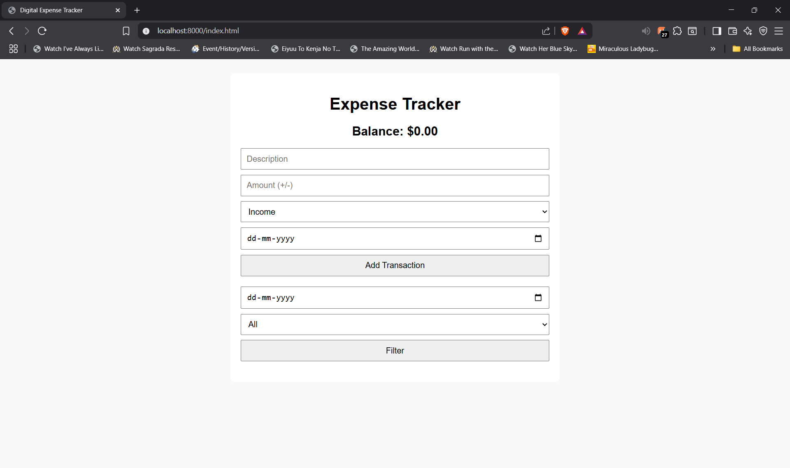
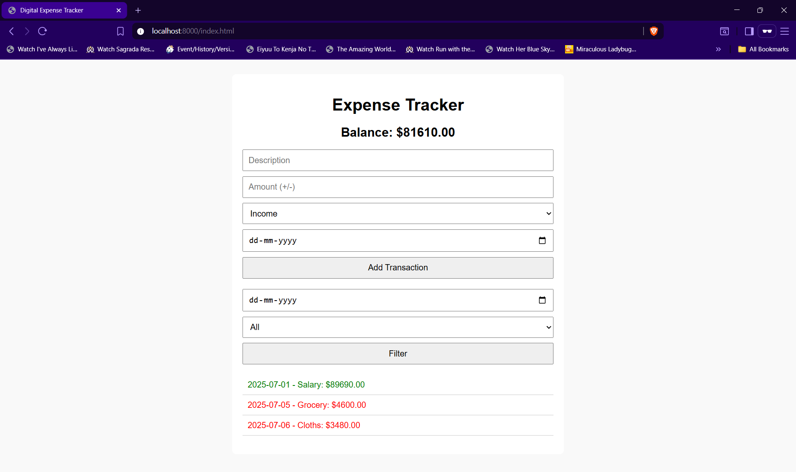

# 💰 Digital Expense Tracker

A simple web-based expense tracking application built with HTML, CSS, and JavaScript.

---

## 📌 Project Description

This digital expense tracker allows users to manage their finances by recording income and expense transactions, viewing their balance, and filtering records by date and type. Data is stored in the browser's local storage so it persists between sessions.

---

## ✅ Features

- Add **Income** and **Expense** entries
- View current **balance**
- View full **transaction history**
- **Filter** transactions by date and type
- **Local storage** support (no backend needed)

---

## 🖼️ Screenshots





---

## 🚀 How to Run

1. **Clone the repo**:

   ```bash
   git clone https://github.com/yourusername/expense-tracker.git
   cd expense-tracker

2. Open index.html in your browser:

You can simply double-click on the file or use Live Server (VS Code extension) for live reload support.

open index.html

3. Start tracking your income and expenses!